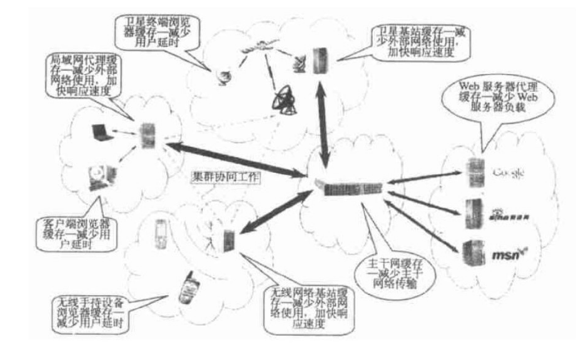
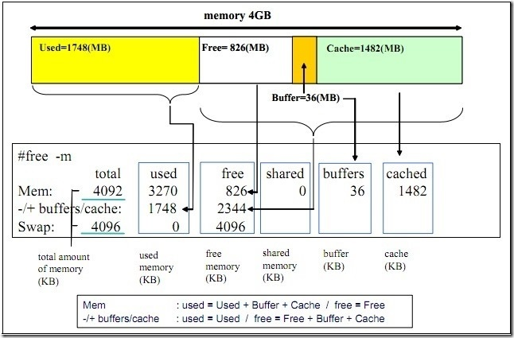

# 缓存介绍

Quickly create a rich document.

## 什么是缓存

---

缓： 缓冲，缓解矛盾 （不是缓慢，反而应该是除CPU/GPU之外最快的）

存：占有储存空间资源

缓存：缓存就是数据交换的缓冲区。临时存贮的那些交换频繁的数据/文件，以便于快速的访问。

缓存的介质类型

- 内存型缓存
- 文件型缓存
- 数据库型缓存

???

# 有哪些缓存

---

缓存的类型很多， 从访问的开始到结束 ，各个layer理论上都可以有缓存。

- CPU的缓存

    ### CPU的缓存

    ---

    最简单的调整缓存 配置图

    

    三级缓存的处理器

    

    图3.3 多处理器、多核心、多线程

    ---

    

    

### Linux文件缓存

---

    wuab@iuc01:~$ free -m
                  total        used        free      shared  buff/cache   available
    Mem:          31986       20049         551        1330       11385       11815
    Swap:             0           0           0

Mem：表示物理内存统计。
total：表示物理内存总量(total = used + free)。
used：表示总计分配给缓存（包含buffers 与cache ）使用的数量，但其中可能部分缓存并未实际使用。
free：未被分配的内存。
shared：共享内存。
buffers：系统分配但未被使用的buffers数量。
cached：系统分配但未被使用的cache数量。
-/+ buffers/cache：表示物理内存的缓存统计。
used2：也就是第一行中的used – buffers - cached也是实际使用的内存总量。 // used2为第二行
free2 = buffers1 + cached1 + free1 // free2为第二行，buffers1等为第一行
free2：未被使用的buffers与cache和未被分配的内存之和，这就是系统当前实际可用内存。
Swap：表示硬盘上交换分区的使用情况。

在Free命令中显示的buffer和cache，它们都是占用内存：

buffer : 作为buffer cache的内存，是块设备的读写缓冲区，更靠近存储设备，或者直接就是disk的缓冲区。

cache: 作为page cache的内存, 文件系统的cache，是memory的缓冲区 。

如果cache 的值很大，说明cache住的文件数很多。如果频繁访问到的文件都能被cache住，那么磁盘的读IO 必会非常小 。

在 Linux 中，当App需要读取Disk文件中的数据时，Linux先分配一些内存，将数据从Disk读入到这些内存中，然后再将数据传给App。当需要往文件中写数据时，Linux先分配内存接收用户数据，然后再将数据从内存写到Disk上。Linux Cache 管理指的就是对这些由Linux分配，并用来存储文件数据的内存的管理。

下图描述了 Linux 中文件 Cache 管理与内存管理以及文件系统的关系。从图中可以看到，在 Linux 中，具体的文件系统，如 ext2/ext3/ext4 等，负责在文件 Cache和存储设备之间交换数据，位于具体文件系统之上的虚拟文件系统VFS负责在应用程序和文件 Cache 之间通过 read/write 等接口交换数据，而内存管理系统负责文件 Cache 的分配和回收，同时虚拟内存管理系统(VMM)则允许应用程序和文件 Cache 之间通过 memory map的方式交换数据，FS Cache底层通过SLAB管理器来管理内存。

### 浏览器的缓存

---

### 代理服务器的缓存

---

### CDN的缓存

---

### AliCDN架构

---

[cdn-brief-manual-cn-zh-2016-05-11.pdf](cache/cdn-brief-manual-cn-zh-2016-05-11.pdf)

## 缓存的模式

---

### Cache Aside Pattern

---

缓存与数据库的异构导致事务不一致，更新事务未结束时，读操作造成脏数据 ，尤其在事务很慢的时候。

可以使用2PC或者Paxios协议保证一致性，但2PC太慢， Paxios太复杂。

当前模式相对概率会低点（但在医时的情况下严重些）

### Write Behind Pattern

---

实现逻辑比较复杂，需要track哪些需要刷到持久层的
数据不是强一致，可能会丢失

### Read/Write Through Pattern

---

缓存与数据库的异构导致事务不一致，更新事务未结束时，读操作造成脏数据 ，尤其在事务很复杂很慢的时候

### 缓存一致性

---

# 缓存的关键

---

- 时间
- 成本

# 缓存的难点

---

- 数据的有效性(置换/过期)
- 数据的一致性： AP + 最终一致

# 缓存的置换策略

---

- **Least Frequently Used(LFU)**
将访问次数最少的内容替换出Cache。
- **Least Recently User(LRU)**
将最近最少使用的内容替换出Cache。
- **Two Queues(2Q)**
把被访问的数据放到一个缓存中（FIFO），如果这个对象再一次被访问，就把他转移到第二个、更大的LRU缓存。
- **Multi Queue(MQ)**
MQ算法根据访问频率将数据划分为多个队列，不同的队列具有不同的访问优先级，其核心思想是：优先缓存访问次数多的数据
- **Adaptive Replacement Cache**
由2个LRU组成，第一个LRU包含最近只被使用过一次的对象，第二个LRU包含最近访问超过两次以上的对象。因此，L1放的是新的对象， L2放的是常用的对象。

- **First in First out (FIFO)， Second Chance ， Clock**
先进先出。
FIFO增强版， 设置标志位，清除前如果已经使用过则清除标志位并新增至队列
环形列表，
- **Simple time-based** 
通过绝对的时间周期去失效缓存对象。
- **Extended time-based expiration**
通过相对时间失效缓存对象。
- **Sliding time-based expiration**
缓存对象的生命起点是在这个缓存的最后被访问时间算起

# **缓存更新**

---

一般来说缓存的更新有两种情况:

- 先删除缓存，再更新数据库。
- 先更新数据库，再删除缓存。

## **先删除缓存，再更新数据库**

对于一个更新操作简单来说，就是先去各级缓存进行删除，然后更新数据库。这个操作有一个比较大的问题，在对缓存删除完之后，有一个读请求，这个时候由于缓存被删除所以直接会读库，读操作的数据是老的并且会被加载进入缓存当中，后续读请求全部访问的老数据。

[https://camo.githubusercontent.com/cc391f324d9d4e2bb72b2b45c2482a91bc2408a8/68747470733a2f2f757365722d676f6c642d63646e2e786974752e696f2f323031382f382f32322f313635363030653437386130616561373f773d3131303926683d36313126663d706e6726733d3536383933](https://camo.githubusercontent.com/cc391f324d9d4e2bb72b2b45c2482a91bc2408a8/68747470733a2f2f757365722d676f6c642d63646e2e786974752e696f2f323031382f382f32322f313635363030653437386130616561373f773d3131303926683d36313126663d706e6726733d3536383933)

对缓存的操作不论成功失败都不能阻塞我们对数据库的操作，那么很多时候删除缓存可以用异步的操作，但是先删除缓存不能很好的适用于这个场景。

先删除缓存也有一个好处是，如果对数据库操作失败了，那么由于先删除的缓存，最多只是造成Cache Miss。

## 4**先更新数据库，再删除缓存(推荐)**

如果我们使用更新数据库，再删除缓存就能避免上面的问题。但是同样的引入了新的问题,试想一下有一个数据此时是没有缓存的，所以查询请求会直接落库，更新操作在查询请求之后，但是更新操作删除数据库操作在查询完之后回填缓存之前，就会导致我们缓存中和数据库出现缓存不一致。

为什么我们这种情况有问题，很多公司包括Facebook还会选择呢？因为要触发这个条件比较苛刻。

1. 首先需要数据不在缓存中。
2. 其次查询操作需要在更新操作先到达数据库。
3. 最后查询操作的回填比更新操作的删除后触发，这个条件基本很难出现，因为更新操作的本来在查询操作之后，一般来说更新操作比查询操作稍慢。但是更新操作的删除却在查询操作之后，所以这个情况比较少出现。

对比之前的问题来说这种问题的概率很低，况且我们有超时机制保底所以基本能满足我们的需求。如果真的需要追求完美，可以使用二阶段提交，但是其成本和收益一般来说不成正比。

# **缓存设计实践**

---

## **1 Memached Multiget-Hole(multiget黑洞)**

在Memcached采用数据分片方式部署的情况下，对于multiget命令来说，部署部署更多的节点，并不能提升multiget的承载量，甚至出现节点数越多，multiget的效率反而会降低，这就是multiget黑洞。这是由于执行multiget命令时，会对每一个节点进行访问，通常SLA取决于最慢最坏的节点，而且节点数增多，出问题的概率也增大，客户端处理的压力也会增大。通常在数据分片时，我们推荐4~8个节点左右。解决multiget黑洞有两种方式可供参考：

- 使用多副本的方式扩容，增加multiget的承载量
- 通过业务层面来控制，multiget的keys尽可能放在同一个节点上，但具体实施时较难操作，可行性不是很高。

## **2 反向Cache**

反向Cache就是将一个不存在的key放在缓存中，也就是在缓存中存一个空值。在某些场景下，比如微博维度的计数场景，若采用cache+DB的存储方式，由于大多数的微博并不存在转发、评论计数，这种场景下，就会出现由于大量访问不存在计数的mid，导致DB压力居高不下的情况。通过在cache中存一个null值，可减少对DB的穿透。当然这也存在潜在的风险或问题：

- 如果每次都是不同的mid，缓存效果可能不明显
- 需要更多的缓存容量

## **3 缓存Fail-Fast (快速失败)**

当缓存层某个节点出现故障时，会导致请求持续穿透到存储层，使请求响应时间长(需要等到读写故障缓存节点超时)，并且存储层负载居高不下。这就需要在使用缓存时考虑快速失败机制。快速失败指的是：当出现故障节点时，标识故障节点为不可用节点（策略举例：连续N次请求都出现超时，标识M时间段内为不可用)，读写不可用节点快速返回。通过快速失败策略，解决请求响应时间长问题，保证SLA。

## **4 缓存无过期(Cache is Storage)**

缓存无过期是指缓存中存储全量数据，不存在数据穿透的情况。 相比于缓存+DB的访问模型，使用内存存储简单可靠，但相应的内存成本也较高。选择内存缓存还是内存存储，需要结合具体的业务场景做权衡，比如单纯为解决Dog-Pile Effect而采用内存存储的话，内存成本可能就无法接受。通常情况下，内存存储模式，适合总体数据量很小，但是访问量巨大的业务场景，比如微博应用(来自weibo.com，weico等)列表。

## **5 dog-pile effect (狗桩效应)**

狗桩效应是由于极热访问的缓存数据失效，大量请求发现没有缓存，进而穿透至DB，导致数据库load瞬间飙高甚至宕机。这是一个典型的并发访问穿透问题，理想情况下缓存失效对数据库应该只有一次穿透。要解决这个问题，首先从代码层面就要考虑到并发穿透的情况，保证一个进程只有一次穿透；同时，可以考虑使用基于mc的分布式锁来控制。不过使用分布式锁来实现会较为繁琐，通常在代码层面进行控制，就可以得到很好的效果。

## **6 极热点数据场景**

微博在遇到一些突发事件时(如文章事件)，流量会出现爆发式的增长，大量的热点数集中访问，导致某个缓存资源遇到性能瓶颈(比如明星的数据所在的端口)，最终接口响应变慢影响正常的服务。为了应对这个问题我们在前端使用local cache, 以缓解后端缓存的压力。但是有些业务场景下，由于各种海量业务数据的冲刷，前端使用 local cache，命中率可能不高，性能提升也不明显，这种业务场景下可以考虑引入L1结构，通过部署多组小容量的L1缓存来应对突然的访问量增长。

## **7 避免雪崩**

雪崩效应是由于缓存服务器宕机等原因导致命中率降低，大量的请求穿透到数据库，导致数据库被冲垮，业务系统出现故障，服务很难再短时间内回复。避免雪崩主要从以下几方面考虑：

- 缓存高可用

避免单点故障，保证缓存高命中率

- 降级和流控

故障期间通过降级非核心功能来保证核心功能可用性

故障期间通过拒掉部分请求保证有部分请求还能正常响应

- 清楚后端资源容量

更好的预知风险点，提前做好准备

即使出现问题，也便于更好的流控(具体应该放量多少)

## **8 数据一致性**

我们知道，在CAP理论下，只能取其二，而无法保证全部。在分布式缓存中，通常要保证可用性(A)和可扩展性(P)，并折中采用数据最终一致性，最终一致性包括：

- Master与副本一致性
- Cache与Storage一致性
- 业务各维度缓存数据一致性

## **9 缓存容量规划**

进行缓存容量规划时，主要从以下几个方面进行考虑：

- 请求量
- 命中率：预热，防止雪崩
- 网络带宽：网卡、交换机
- 存储容量：预估存储大小，过期策略、剔除率
- 连接数

## 10 缓存污染

缓存污染一般出现在我们使用本地缓存中，可以想象，在本地缓存中如果你获得了缓存，但是你接下来修改了这个数据，但是这个数据并没有更新在数据库，这样就造成了缓存污染:

上面的代码就造成了缓存污染，通过id获取Customer，但是需求需要修改Customer的名字，所以开发人员直接在取出来的对象中直接修改，这个Customer对象就会被污染，其他线程取出这个数据就是错误的数据。

[https://camo.githubusercontent.com/e08f244bd67bbc9ec2a062e20f609923d3df3f40/68747470733a2f2f757365722d676f6c642d63646e2e786974752e696f2f323031382f382f32322f313635363230396234306430376164653f773d3132303026683d32393626663d706e6726733d3736323537](https://camo.githubusercontent.com/e08f244bd67bbc9ec2a062e20f609923d3df3f40/68747470733a2f2f757365722d676f6c642d63646e2e786974752e696f2f323031382f382f32322f313635363230396234306430376164653f773d3132303026683d32393626663d706e6726733d3736323537)

要想避免这个问题需要开发人员从编码上注意，并且代码必须经过严格的review，以及全方位的回归测试，才能从一定程度上解决这个问题。

## 11 序列化

序列化是很多人都不注意的一个问题，很多人忽略了序列化的问题，上线之后马上报出一下奇怪的错误异常，造成了不必要的损失，最后一排查都是序列化的问题。列举几个序列化常见的问题:

1. key-value对象过于复杂导致序列化不支持:笔者之前出过一个问题，在美团的Tair内部默认是使用protostuff进行序列化，而美团使用的通讯框架是thfift，thrift的TO是自动生成的，这个TO里面很多复杂的数据结构，但是将其存放到了Tair中。查询的时候反序列化也没有报错，单测也通过，但是到qa测试的时候发现这一块功能有问题，发现有个字段是boolean类型默认是false，把它改成true之后，序列化到tair中再反序列化还是false。定位到是protostuff对于复杂结构的对象(比如数组，List等等)支持不是很好，会造成一定的问题。后来对这个TO进行了转换，用普通的Java对象就能进行正确的序列化反序列化。
2. 添加了字段或者删除了字段，导致上线之后老的缓存获取的时候反序列化报错，或者出现一些数据移位。
3. 不同的JVM的序列化不同，如果你的缓存有不同的服务都在共同使用(不提倡)，那么需要注意不同JVM可能会对Class内部的Field排序不同，而影响序列化。比如下面的代码，在Jdk7和Jdk8中对象A的排列顺序不同，最终会导致反序列化结果出现问题:

    //jdk 7
    class A{
        int a;
        int b;
    }
    //jdk 8
    class A{
        int b;
        int a;
    }

序列化的问题必须得到重视，解决的办法有如下几点:

1. 测试:对于序列化需要进行全面的测试，如果有不同的服务并且他们的JVM不同那么你也需要做这一块的测试，在上面的问题中笔者的单测通过的原因是用的默认数据false，所以根本没有测试true的情况，还好QA给力，将其给测试出来了。
2. 对于不同的序列化框架都有自己不同的原理，对于添加字段之后如果当前序列化框架不能兼容老的，那么可以换个序列化框架。 对于protostuff来说他是按照Field的顺序来进行反序列化的，对于添加字段我们需要放到末尾，也就是不能插在中间，否则会出现错误。对于删除字段来说，用@Deprecated注解进行标注弃用，如果贸然删除，除非是最后一个字段，否则肯定会出现序列化异常。
3. 可以使用双写来避免，对于每个缓存的key值可以加上版本号，每次上线版本号都加1，比如现在线上的缓存用的是Key_1，即将要上线的是Key_2,上线之后对缓存的添加是会写新老两个不同的版本(Key_1,Key_2)的Key-Value，读取数据还是读取老版本Key_1的数据,假设之前的缓存的过期时间是半个小时，那么上线半个小时之后，之前的老缓存存量的数据都会被淘汰，此时线上老缓存和新缓存他们的数据基本是一样的,切换读操作到新缓存，然后停止双写。采用这种方法基本能平滑过渡新老Model交替，但是不好的点就是需要短暂的维护两套新老Model，下次上线的时候需要删除掉老Model，增加了维护成本。

# 其他

---

## Cache 和 Buffer 的区别

**Buffer**（缓冲区）是系统两端处理**速度平衡**（从长时间尺度上看）时使用的。它的引入是为了减小短期内突发I/O的影响，起到**流量整形**的作用。比如生产者——消费者问题，他们产生和消耗资源的速度大体接近，加一个buffer可以抵消掉资源刚产生/消耗时的突然变化。2、**Cache**（缓存）则是系统两端处理**速度不匹配**时的一种**折衷策略**。因为CPU和memory之间的速度差异越来越大，所以人们充分利用数据的局部性（locality）特征，通过使用存储系统分级（memory hierarchy）的策略来减小这种差异带来的影响。3、假定以后存储器访问变得跟CPU做计算一样快，cache就可以消失，但是buffer依然存在。比如从网络上下载东西，瞬时速率可能会有较大变化，但从长期来看却是稳定的，这样就能通过引入一个buffer使得OS接收数据的速率更稳定，进一步减少对磁盘的伤害。4、TLB（Translation Lookaside Buffer，翻译后备缓冲器）名字起错了，其实它是一个cache.

作者：知乎用户链接：https://www.zhihu.com/question/26190832/answer/32387918来源：知乎著作权归作者所有。商业转载请联系作者获得授权，非商业转载请注明出处。

Buffer不是缓存，国内常用的翻译是缓冲区。其次，大部分场景中，Buffer是特指内存中临时存放的IO设备数据——包括读取和写入；而Cache的用处很多——很多IO设备（例如硬盘、RAID卡）上都有Cache，CPU内部也有Cache，浏览器也有Cache。Buffer并非用于提高性能，而Cache的目的则是提高性能。涉及到IO设备读写的场景中，Cache的一部分本身就是Buffer的一种。如果说某些场合Buffer可以提升IO设备的读写性能，只不过是因为Buffer本身是Cache系统的一部分，性能提升来自于Cache机制。Buffer占用的内存不能回收，如果被强行回收会出现IO错误。Cache占用的内存，除实现Buffer的部分外都可以回收，代价则是下一次读取需要从数据的原始位置（通常是性能更低的设备）读取。在IO读写过程中，任何数据的读写都必然会产生Buffer，但根据Cache算法，可能会有相当部分数据不会被Cache。

作者：木头龙链接：https://www.zhihu.com/question/26190832/answer/825301105来源：知乎著作权归作者所有。商业转载请联系作者获得授权，非商业转载请注明出处。

## 内存数据库与内存共享技术

## EHCACHE

