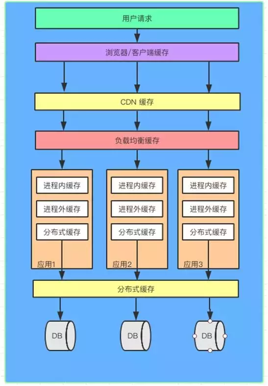

# 多级缓存

Quickly create a rich document.

# 什么是多级缓存

---

广泛意义上从请求到返回结果中各个layer都可以缓存数据，从而提高反应速度

一般我们指的服务器端两级/多级缓存框架，都是指的从进程内缓存到数据库访问前的各个级别的缓存

### CPU的缓存

---

最简单的调整缓存配置图

三级缓存的处理器

图3.3 多处理器、多核心、多线程

---

### Web缓存体系结构

---

**3.1.1 层次式缓存体系结构**

Harvest项目[3]首先提出了层次式Web缓存体系结构。在层次式缓存体系结构中，Cache在网络呈多级配置，如图1（a）所示。为简单起见，假定有四级：底层Cache、局域层Cache、区域层Cache、广域层Cache。底层是客户/浏览器Cache，当客户端Cache不能满足客户的请求时，该请求被转发到局域层Cache，如果仍然得不到满足，则该请求被转发到区域层Cache直至广域层Cache。如果该请求在各级Cache中都得不到满足，则请求最终被转发到服务器。然后服务器对该请求的响应自顶向下地发送给客户，在沿途的每一个中间层Cache中留下一个副本。请求相同内容的其它请求则自下而上地进行转发，直到在某一级Cache中得到满足。

层次式缓存体系结构带宽效率高，点击率较高的Web内容可以快速高效地分布到网络中。但该体系结构也存在一些不足[4]：

（1）建立层次式缓存体系结构，缓存服务器必须配置在网络中关键的访问点上，缓存服务器间需相互合作；

（2）每一级Cache都会带来额外的延迟；

（3）高层Cache可能会成为瓶颈并带来较长的排队延迟；

（4）同一个内容的多个副本被保存在不同的Cache中，整个系统Cache空间利用率不高。

**3.1.2 分布式缓存体系结构**

针对层次式缓存结构的上述缺陷，一些研究者提出了分布式缓存体系结构，在这种结构中，只有低层Cache,如图1（b）所示。文献[5]中的分布式Web缓存结构中，没有超出局域层的中间Cache层，Cache之间相互协作以处理失效。为了确定将客户请求转发给哪一个局域层Cache来获取失效的内容，每一个局域层Cache保留一份其它局域层Cache中缓存内容的目录信息，以便发生失效时将客户请求准确地转发到相应的局域层Cache。缓存阵列路由协议CARP [6]（Cache Array Routing protocol）是一种分布式缓存方案，它将URL空间分割成不同的部分，将每一部分指定给一组松散耦合的Cache组，每个Cache只能缓存具有指定给它的URL的Web内容，从而可以根据客户请求内容的URL来确定将请求转发给哪一个Cache。

在分布式缓存结构中，大多数的网络流量都发生在网络底层，不容易产生网络拥塞，Cache空间利用率高，且可以更好地实现负载共享，容错性更好。然而，一个大规模的分布式缓存系统的配置可能会遇到几个问题：连接次数较多、带宽要求高、管理困难[4]。

**3.1.3 混合式缓存体系结构**

混合式体系结构如图1（c）所示，同级Cache采用分布式缓存结构，相互合作。Harvest集团设计的互联网缓存协议ICP（the Internet Cache Protocol）支持从RTT最小的父Cache或邻居Cache中获取相应的内容。

**3.1.4 缓存体系结构的优化**

研究表明

[4]

层次式缓存体系结构和分布式缓存结构相比，层次式缓存体系结构具有较短的连接时间，因此将较小的文档缓存在中间层Cache中可以减少访问延迟；分布缓存结构具有较短的传输时间和较高的带宽利用率。理想的方案就是将二者结合起来，充分发挥各自的长处，同时减少连接时间和传输时间。

[Web缓存技术概述.doc](multi-level-cache/Web.doc)

## 有赞多级缓存解决方案 TMC

---

TMC 整体架构如上图，共分为三层：

- 存储层：提供基础的kv数据存储能力，针对不同的业务场景选用不同的存储服务（ codis / zankv / aerospike ）；
- 代理层：为应用层提供统一的缓存使用入口及通信协议，承担分布式数据水平切分后的路由功能转发工作；
- 应用层：提供统一客户端给应用服务使用，内置“热点探测”、“本地缓存”等功能，对业务透明；

TMC 本地缓存整体结构分为如下模块：

- **Jedis-Client**： Java 应用与缓存服务端交互的直接入口，接口定义与原生 Jedis-Client 无异；
- **Hermes-SDK**：自研“热点发现+本地缓存”功能的SDK封装， Jedis-Client 通过与它交互来集成相应能力；
- **Hermes服务端集群**：接收 Hermes-SDK 上报的缓存访问数据，进行热点探测，将热点 key 推送给 Hermes-SDK 做本地缓存；
- **缓存集群**：由代理层和存储层组成，为应用客户端提供统一的分布式缓存服务入口；
- **基础组件**： etcd 集群、 Apollo 配置中心，为 TMC 提供“集群推送”和“统一配置”能力；

#
